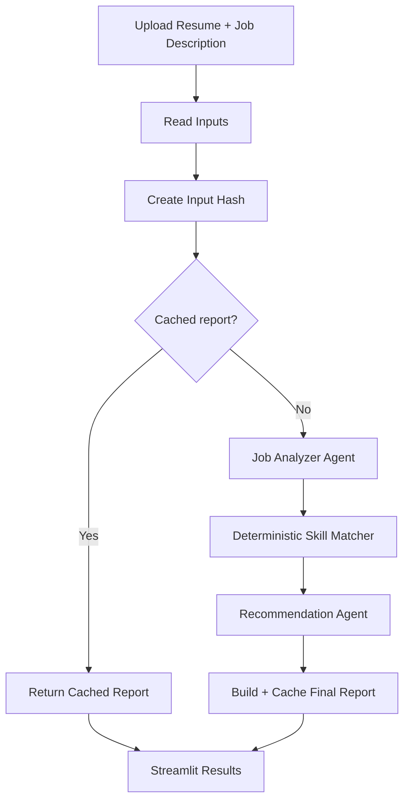

# CareerPilot AI Architecture

CareerPilot separates deterministic résumé matching from LLM-based language understanding. LangGraph coordinates each stage and decides whether a cached result can be reused.

## Workflow

## Components

- `resume_reader.py` — extracts text from text-based PDF résumés with `pypdf`.
- `job_analyzer.py` — uses Gemini structured output to convert a job description into required skills, preferred skills, responsibilities, and ATS keywords.
- `skill_matcher.py` — performs deterministic alias-aware skill matching and calculates required/preferred scores.
- `recommendation_agent.py` — generates grounded strengths, gaps, résumé improvements, learning steps, interview questions, and a next action.
- `cache.py` — hashes the résumé and job description and reuses an identical saved report.
- `graph.py` — defines the LangGraph state, nodes, router, and final workflow.
- `app.py` — provides the Streamlit interface.

## Design choice

The LLM does **not** invent the numeric ATS score. CareerPilot calculates matching with deterministic Python logic, while Gemini handles tasks that benefit from language understanding.

## Privacy

Uploaded résumé and job-description files are written only to temporary files by the UI and deleted after analysis. Personal PDF files, `.env`, and generated reports are ignored by Git.
